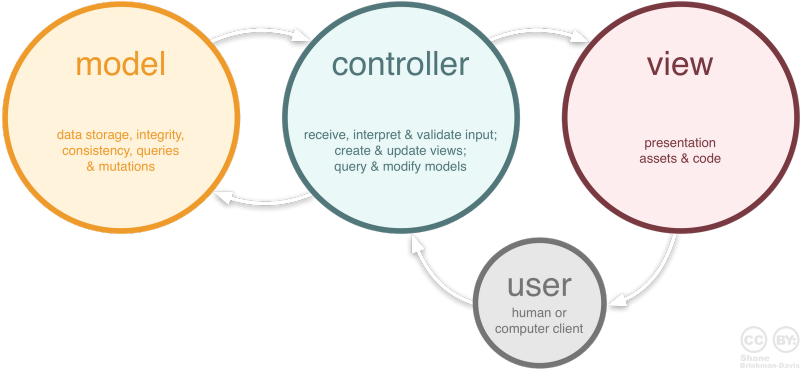
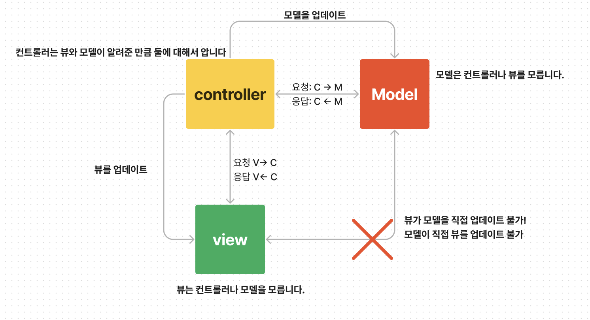
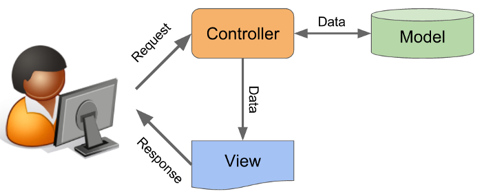

# MVC 패턴
> MVC란 Model, View, Controller의 약자이다. 하나의 어플리케이션, 프로젝트를 구성할 때 그 구성요소를 세가지의 역할로 구분한 패턴이다. 개발 프로세스에서 각각 구성요소에 대해 집중해서 개발할 수 있고, **재사용**성과 **확장성**이 용이하다. 단, 복잡해질수록 모델과 뷰의 관계가 복잡해진다.

 
 

 

### Model

- **데이터와 비즈니스 로직을 관리**
- 데이터를 다루는 로직을 모델에 모아둬서 데이터와 뷰를 격리 시키는 것
- 사용자의 질의(query)에 대해 상태 정보를 제공하거나 상태를 수정
- 코드 관리의 편의성을 높일 수 있음
- 향후 데이터베이스 교체가 용이
- 뷰나 컨트롤러에 대해 어떤한 정보도 알지 못함

### View

- **화면상에 출력되는 내용을 의미 (사용자가 보는 페이지)**
- UI와 관련된 코드
- 클라이언트 측 기술인 html/css/javascript들을 모아둔 컨테이너
- 모델이나 컨트롤러에 대해 어떠한 정보도 알지 못함

### Controller

- **Model과 View를 중간에서 제어**
- 사용자가 접근 한 URL에 따라 사용자의 요청사항을 파악
- 요청에 맞는 데이터를 Model에 의뢰 / 데이터를 View에 반영해서 사용자에게 알려줌
- 모델이나 뷰에 대해서 알고 있어야 함

--- 

 
 
 

💡 **MVC 패턴의  사용 이유**

1. 하나의 역할만 담당 및 처리하므로 효율적이게 됨
2. **유지보수성**, 애플리케이션의 **확장성**, **_유연성_** 증가
3. 중복코딩이라는 문제점 또한 사라짐

\*_유연성: 클라이언트의 새로운 요구사항에 대해 최소한의 비용으로 보다 유연하게 대처할 수 있는 것_

 

💡 **스프링에서의** **MVC** **알아보기** 
  
→ [Spring MVC Framework](https://www.notion.so/Spring-MVC-Framework-27a032162e0e4512bf61c6020460c4d8?pvs=21)

 
 

### **REFERENCE**

---

- https://m.blog.naver.com/jhc9639/220967034588
- [https://velog.io/@nerdchanii/MVC-패턴을-알아보자](https://velog.io/@nerdchanii/MVC-%ED%8C%A8%ED%84%B4%EC%9D%84-%EC%95%8C%EC%95%84%EB%B3%B4%EC%9E%90)
- https://velog.io/@2cong/MVC
