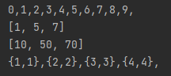

# Lambda_람다식
> **메소드를 “하나의 식”으로 표현한 것**. 하나의 식으로 표현해 훨씬 간략하게 표현이 가능하며, 메소드의 이름과 반환값이 없어지므로 “**익명함수**”라고도 한다.

<br>

## 예제와 함께 람다식 알아보기

```java
int[] arr = new int[5];
Arrays.setAll(arr, (i) -> (int) (Math.random() * 5) + 1);
System.out.println(Arrays.toString(arr);

int method() {
	return (int) (Math.random() * 5) + 1;
}
```

`(i) -> (int) (Math.random() * 5) + 1` 가 람다식이며 아래 **`method()`**와 같은 의미를 가진다. 

람다식은 

1. 그 자체만으로도 메소드의 역할을 대신할 수 있고, 
2. 메서드의 매개변수로 전달되어지는 것도 가능하고,
3. 메서드의 결과로 반환될 수도 있다. 

**즉, 람다식으로 메소드를 변수처럼 다루는 것이 가능!**

<br>

## 람다식 작성하기
1. 메소드에서 이름과 반환 타입을 제거 
2. 매개변수 선언부와 몸통{ } 사이에 `->` 추가하기
3. 조건에 따라

 3.1 매개변수가 하나뿐인 경우 괄호 `( )`생략 가능

 3.2 중괄호 `{ }` 내 문장이 하나일 경우 생략 가능(  문장 끝 `;` 사용X )

 3.3 중괄호 `{ }` 내 `return`문일 경우 생략 불가( `;` 사용O )

```java
// 원형
int max(int a, int b){
	return a>b? a:b;
}

// 1, 2번 수행
(int a, int b) -> { return a>b? a:b; }
// 3.3
(int a, int b) -> a>b? a:b;
// 3.1
(a,b) -> a>b? a:b;
```

<br>

## java.util.function 패키지
> 자주 쓰이는 형식의 메소드를 함수형 인터페이스로 미리 정의해 놓은 패키지. 재사용성 증가, 유지보수 측면에서 좋음.
 
<br>

## 함수형 인터페이스
> 매개변수와 반환값의 유무에 따라 4개의 함수형 인터페이스가 정의되어 있음.

| 함수형 
인터페이스 | 메서드 | 반환타입 | 설명 |
| :--- | :--- | :---: | :--- |
| java.lang.Runnable | run() | void | 매개변수도 없고, 반환 값도 없다. |
| Supplier<T> | get() | T | 매개변수는 없고 반환 값만 있다. |
| Consumer<T> | accept(T t) | void | Suplier와 반대로 매개변수만 있고, 반환 값이 없다. |
| Function<T,R> | apply(T t) | R | 일반적인 함수로, 하나의 매개변수를 받아서 결과를 반환한다. |
| Predicate<T> | test(T t) | boolean | 조건식을 표현하는데 사용되며매개변수는 하나, 반환 타입은 boolean이다. |

<br>

## 매개변수가 두개인 함수형 인터페이스
> 이름 앞에 “ Bi “ 접두사가 붙어있음.
> 

| 함수형 
인터페이스 | 메서드 | 반환타입 | 설명 |
| :--- | :--- | :---: | :--- |
| BiConsumer<T, U> | accept(T t, U u) | void | 두 개의 매개변수만 있고, 반환 값이 없다. |
| BiFunction<T, U, R> | apply(T t, U u) | R | 두 개의 매개변수를 받아서 하나의 결과를 반환한다. |
| BiPredicate<T, U> | test(T t, U u) | boolean | 조건식을 표현하는데 사용되며매개변수는 둘, 반환 타입은 boolean. |

<br>

## UnaryOperator, BinaryOperator
> Function의 변형으로 매개변수의 타입과 반환타입이 모두 일치한다는 점 외 Function과 같다.
> 

| 함수형 
인터페이스 | 메서드 | 반환타입 | 설명 |
| :--- | :--- | :---: | :--- |
| UnaryOperator(T) | apply(T t) | T | Function의 자손Function과 달리 매개변수와 결과의 타입이 같다 |
| BinaryOperator<T> | apply(T t, T t) | T | BiFunction의 자손BiFunction과 달리 매개변수와 결과의 타입이 같다. |

<br>

## 컬렉션 프레임워크와 함수형 인터페이스
> 컬렉션 프레임워크의 인터페이스에 다수의 default 메소드가 추가되었는데, 그 중 함수형 인터페이스에 사용되는 메소드 목록이다.
> 

| 인터페이스 | 메서드 | 반환타입 | 설명 |
| :--- | :--- | :---: | :--- |
| Collection | removeIf(predicate<E> filter) | boolean | 조건에 맞는 요소를 삭제 |
| List | replaceAll(UnaryOperator<E> operator) | void | 모든 요소를 변환하여 대체 |
| Iterable | forEach(Consumer<T> action) | void | 모든 요소에 작업 action을 수행 |
| Map | compute(K key, Bifunction<K,V,V> f) | V | 지정된 키의 값에 작업 f를 수행 |
|  | coputeIfAbsent(K key, Function<K,V> f) | V | 키가 없으면, 작업 f 수행 후 추가 |
|  | coputeIfPresent(K key, BiFunction<K,V,V> f) | V | 모든 요소에 병합작업 f를 수행 |
|  | forEach(BiConsumer<K,V> action) | void | 모든 요소에 작업 action을 수행 |
|  | replaceAll(BiFunction<K,V,V> f) | void | 모든 요소에 치환작업 f를 수행 |

<br>

## 예제

```java
class LambdaEx4 {
	public static void main(String[] args) 	{
		ArrayList<Integer> list = new ArrayList<>();
		for(int i=0;i<10;i++) 
			list.add(i);
 
		// list의 모든 요소를 출력
		list.forEach(i->System.out.print(i+","));
		System.out.println();
 
		// list에서 2 또는 3의 배수를 제거한다.
		list.removeIf(x-> x%2==0 || x%3==0);
		System.out.println(list);
 
		list.replaceAll(i->i*10); // list의 각 요소에 10을 곱한다.
		System.out.println(list);
 
		Map<String, String> map = new HashMap<>();
		map.put("1", "1");
		map.put("2", "2");
		map.put("3", "3");
		map.put("4", "4");
 
		// map의 모든 요소를 {k,v}의 형식으로 출력한다.
		map.forEach((k,v)-> System.out.print("{"+k+","+v+"},"));
		System.out.println();
	}
```



<br>
<br>

## **REFERENCE**
- [https://hstory0208.tistory.com/entry/Java자바-람다식Lambda이란-그리고-사용법](https://hstory0208.tistory.com/entry/Java%EC%9E%90%EB%B0%94-%EB%9E%8C%EB%8B%A4%EC%8B%9DLambda%EC%9D%B4%EB%9E%80-%EA%B7%B8%EB%A6%AC%EA%B3%A0-%EC%82%AC%EC%9A%A9%EB%B2%95)
